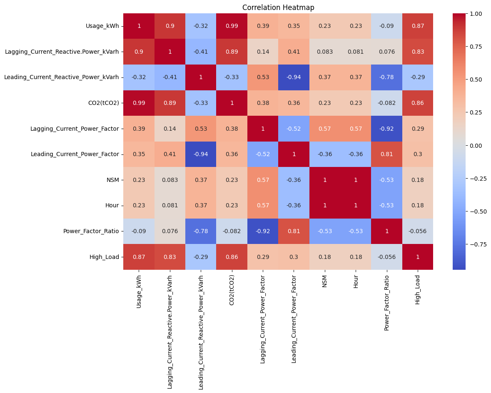
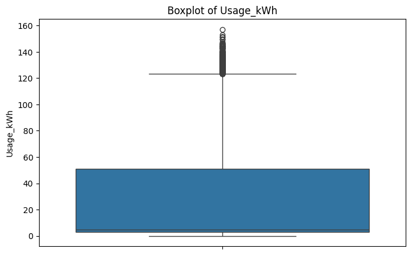
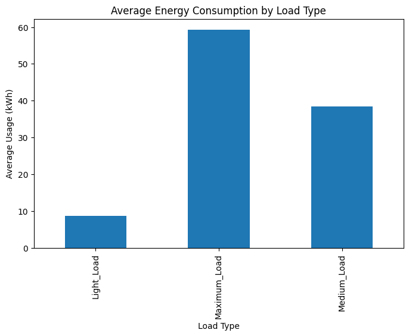
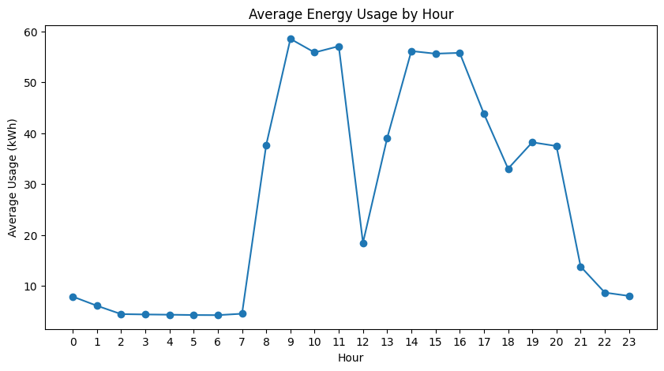
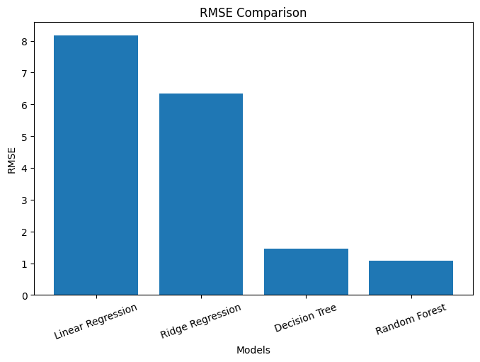
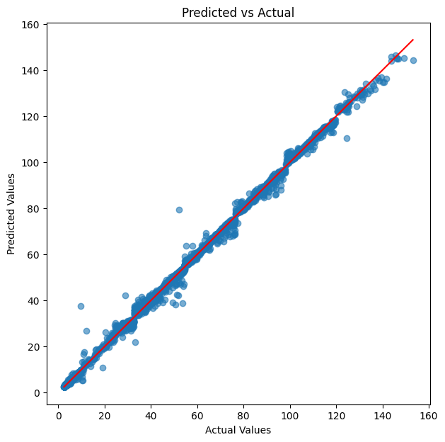

# Steel Energy Consumption Analysis and Baseline Regression Modeling

## Project Overview

This project presents a complete machine learning workflow for analyzing energy consumption in a steel manufacturing plant. It includes data preprocessing, feature engineering, exploratory data analysis (EDA), baseline regression modeling, and model evaluation to understand the factors influencing electricity consumption and establish predictive models.

---

## Dataset Information

The project uses the **Steel Industry Energy Consumption Dataset**, which contains electricity consumption records along with operational parameters collected from a steel manufacturing facility.

### Target Variable

* **Usage_kWh** – Total electricity consumption in kilowatt-hours.

### Dataset Summary

* **Rows:** 35,040
* **Original Features:** 11
* **Target:** Usage_kWh

The dataset includes:

* Active energy consumption
* Reactive power measurements
* Power factor values
* CO₂ emissions
* Load type
* Date and time information

### Run the Project

Open the notebooks in Jupyter Notebook or Visual Studio Code and execute them in the following order:

1. `EDA.ipynb`
2. `Baseline_Models.ipynb`

---

# Feature Engineering

Several new features were created to enhance the dataset.

### Time-Based Features

The original date column was converted into datetime format, and the following features were extracted:

* Hour
* Day of Week
* Month
* Weekend/Weekday

### Power Factor Ratio

A new feature, **Power_Factor_Ratio**, was created by dividing the Leading Current Power Factor by the Lagging Current Power Factor.

### High Load Indicator

A binary feature named **High_Load** was created using the 75th percentile of `Usage_kWh`.

* **1** → High energy consumption
* **0** → Normal energy consumption

This feature was used during exploratory analysis and removed before model training to prevent target leakage.

---

# Exploratory Data Analysis (EDA)

The dataset was analyzed to understand its characteristics and identify meaningful patterns.

The following analyses were performed:

* Dataset overview
* Missing value analysis
* Duplicate record detection
* Summary statistics
* Outlier detection using the IQR method
* Correlation analysis
* Load Type analysis
* Hourly energy consumption analysis

## Key Findings

* The original dataset contained **no missing values** and **no duplicate records**.
* **328 outliers** were identified in the `Usage_kWh` feature using the IQR method.
* `CO2(tCO2)` showed the strongest positive correlation with energy consumption.
* `Lagging_Current_Reactive.Power_kVarh` was also highly correlated with `Usage_kWh`.
* Maximum Load periods consumed considerably more electricity than Light and Medium Load periods.
* Electricity consumption varied throughout the day, indicating a strong relationship between production schedules and energy demand.

---

# EDA Visualizations

## Correlation Heatmap

---

## Outlier Detection (Usage_kWh)

---

## Average Energy Consumption by Load Type

---

## Average Hourly Energy Consumption

---

# Baseline Regression Modeling

After feature engineering, baseline machine learning models were developed to predict electricity consumption.

## Data Preprocessing

The following preprocessing steps were performed:

* Removed unnecessary columns
* Removed engineered `High_Load` feature to avoid target leakage
* Applied One-Hot Encoding to categorical variables
* Split the dataset into 80% training and 20% testing sets

---

## Models Implemented

The following regression algorithms were trained and compared:

* Linear Regression
* Ridge Regression
* Decision Tree Regressor
* Random Forest Regressor

---

## Model Evaluation Metrics

Each model was evaluated using:

* Mean Absolute Error (MAE)
* Root Mean Squared Error (RMSE)
* R² Score
* 5-Fold Cross Validation

---

# Model Results

## RMSE Comparison

---

## Predicted vs Actual Values

---

# Results and Conclusion

This project demonstrates a complete machine learning workflow for predicting industrial energy consumption. Exploratory data analysis revealed strong relationships between electricity usage, reactive power, and carbon emissions. Feature engineering introduced additional temporal and derived variables that improved the dataset for modeling.

Multiple regression models were trained and evaluated using standard performance metrics and cross-validation. Comparing different baseline models provided valuable insights into their predictive capabilities and established a solid foundation for future model improvements.

---

# Technologies Used

* Python
* Pandas
* NumPy
* Matplotlib
* Seaborn
* Scikit-learn
* OpenPyXL
* Jupyter Notebook

---

